# Cytoscape.js ビューア ユーザーガイド

DAG YAML Toolsの高機能インタラクティブビューアです。グラフの可視化、編集、YAML出力が可能です。

## 概要

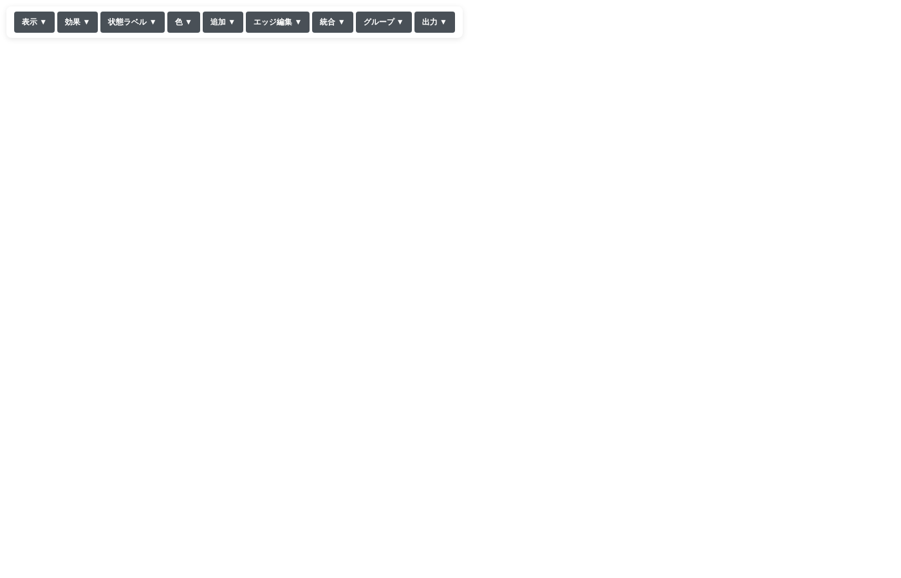

Cytoscape.jsビューアは以下の機能を提供します：

- DAGグラフのインタラクティブな表示
- ノード・エッジの選択、ドラッグ、ズーム
- 表示効果（ハイライト、ローライト、非表示）
- ノード・エッジの追加・編集
- ノードの統合・グループ化
- 色のカスタマイズ
- 編集後のYAML出力

## メニューバー

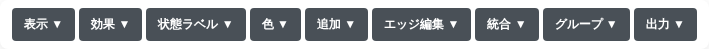

画面上部に折りたたみ式メニューが配置されています。各メニューをクリックするとサブメニューが展開されます。

| メニュー | 説明 |
|---------|------|
| [表示](#表示メニュー) | レイアウトのリセット、全体表示、ラベル切替 |
| [効果](#効果メニュー) | ハイライト、ローライト、非表示 |
| [状態ラベル](#状態ラベルメニュー) | 統合されたエッジラベルの展開・収束 |
| [色](#色メニュー) | 要素の色設定 |
| [追加](#追加メニュー) | ノード・エッジの追加 |
| [エッジ編集](#エッジ編集メニュー) | エッジの接続先変更 |
| [統合](#統合メニュー) | 複数ノードの統合 |
| [グループ](#グループメニュー) | カスタムグループの管理 |
| [出力](#出力メニュー) | YAML出力 |

---

## 表示メニュー

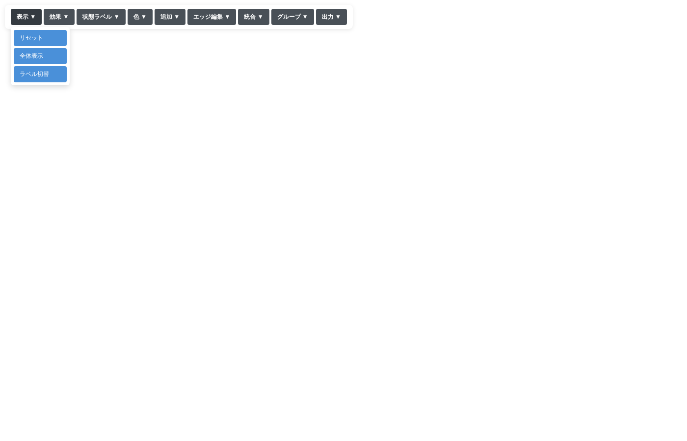

グラフの表示に関する操作です。

| ボタン | 説明 |
|-------|------|
| **リセット** | レイアウトを初期状態に再計算します |
| **全体表示** | グラフ全体が画面に収まるようにズームを調整します |
| **ラベル切替** | ノードのラベル表示を切り替えます（ID/説明） |

### 基本操作

| 操作 | 説明 |
|-----|------|
| ドラッグ | ノードを移動 |
| スクロール | ズームイン/アウト |
| Ctrl+クリック | 複数選択 |
| 背景クリック | 選択解除 |

---

## 効果メニュー

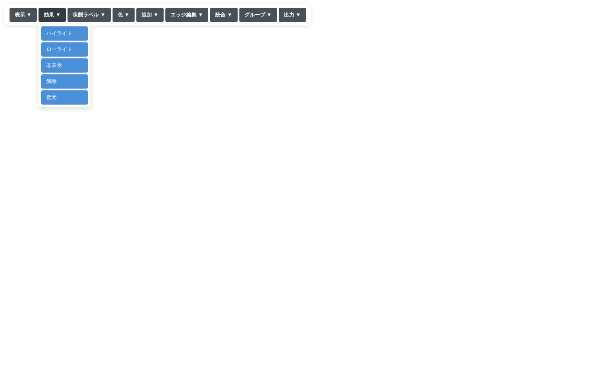

選択した要素に視覚効果を適用します。

| ボタン | 説明 |
|-------|------|
| **ハイライト** | 選択した要素を強調、他を薄く表示 |
| **ローライト** | 選択した要素を薄く表示 |
| **非表示** | 選択した要素を非表示（YAML出力にも反映） |
| **解除** | ハイライト/ローライト効果を解除 |
| **復元** | 非表示にした要素を復元 |

### 使用方法

1. 効果ボタン（ハイライト/ローライト/非表示）をクリック
2. ボタンが緑色になり、モードがONになります
3. ノードまたはエッジをクリックして効果を適用
4. 同じボタンを再度クリックしてモードをOFFに

### ハイライトモードの例

ノードをクリックすると、そのノードと接続されたエッジ・隣接ノードがハイライトされ、他の要素は薄く表示されます。

---

## 状態ラベルメニュー

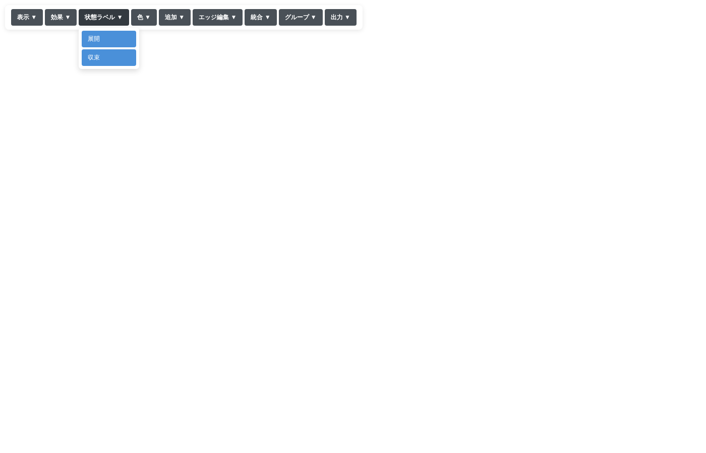

統合されたエッジのラベル表示を制御します。

| ボタン | 説明 |
|-------|------|
| **展開** | 「Any」ラベルを元の状態一覧に展開 |
| **収束** | 展開したラベルを「Any」に戻す |

### 使用方法

1. 統合されたエッジ（ラベルが「Any」）を選択
2. 「展開」をクリック
3. 元の状態が改行区切りで表示されます

---

## 色メニュー

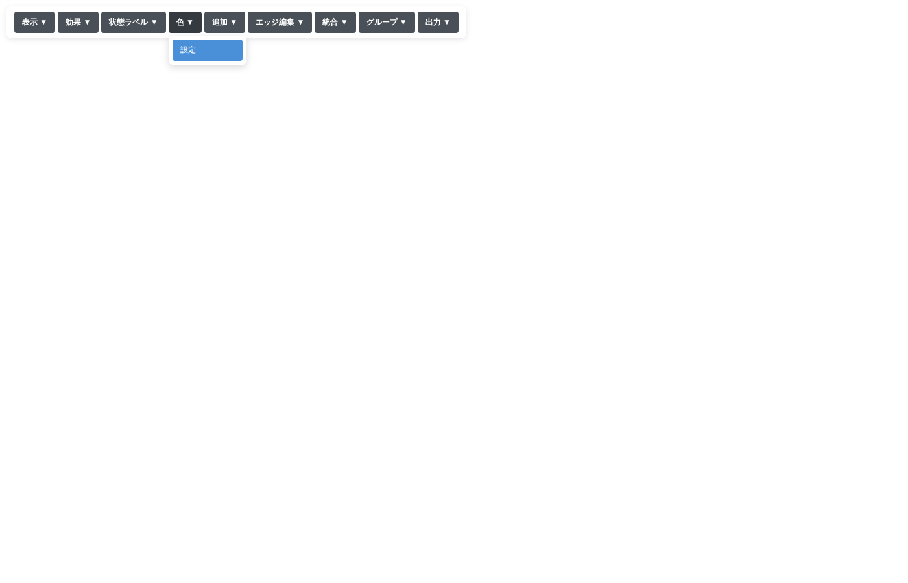

選択した要素の色をカスタマイズします。

### 色設定ダイアログ

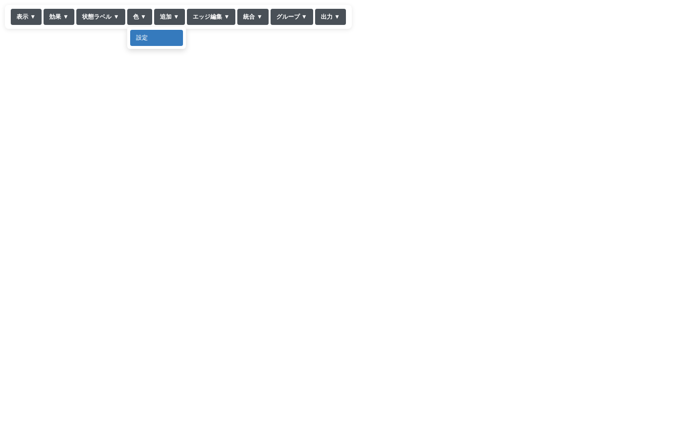

4種類の色を個別に設定できます：

| 項目 | 説明 | 適用対象 |
|------|------|---------|
| **背景色** | ノードの塗りつぶし、エッジの線色 | 全要素 |
| **枠線** | ノードの外枠 | ノード・グループ |
| **文字の縁** | ラベルのアウトライン | ノード・グループ |
| **文字色** | ラベルの文字色 | 全要素 |

### 使用方法

1. Ctrl+クリックで要素を選択
2. 「色」→「設定」をクリック
3. カラーピッカーまたはカラーコード入力で色を指定
4. 各行の「適用」で個別適用、または「全て適用」で一括適用
5. 「リセット」で元の色に戻す

### カラーパレット

30色のプリセットカラーが用意されています。クリックすると背景色に即座に適用されます。

---

## 追加メニュー

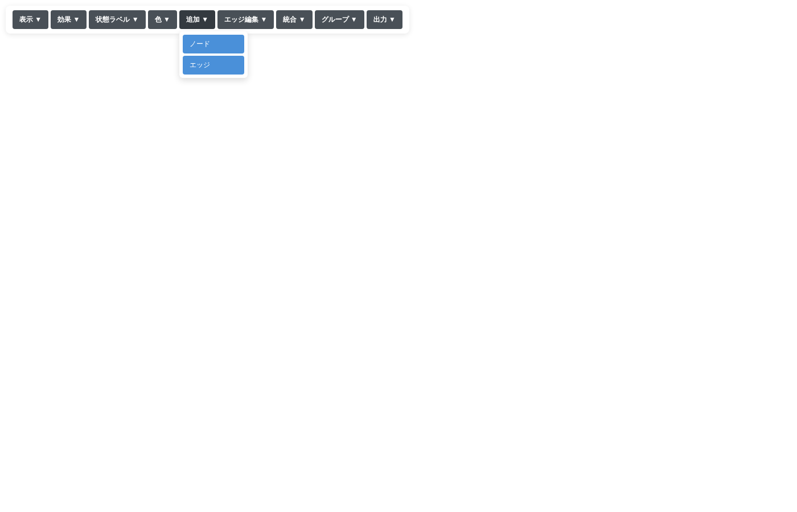

新しいノードやエッジを追加します。

### ノード追加ダイアログ

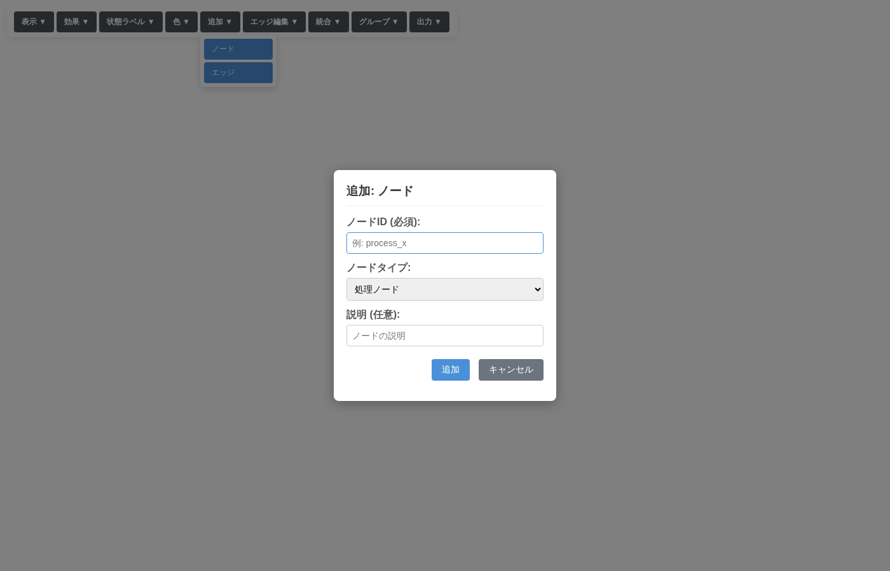

| 項目 | 説明 |
|------|------|
| **ノードID** | ノードの識別子（必須） |
| **ノードタイプ** | 処理ノード / 成功終端 / 失敗終端 |
| **説明** | ノードの説明（任意） |

- 成功終端を選ぶと `exit.success.` プレフィックスが付きます
- 失敗終端を選ぶと `exit.failure.` プレフィックスが付きます

### エッジ追加

| 項目 | 説明 |
|------|------|
| **接続元** | エッジの始点ノード |
| **接続先** | エッジの終点ノード |
| **ラベル** | 状態名（任意） |

---

## エッジ編集メニュー

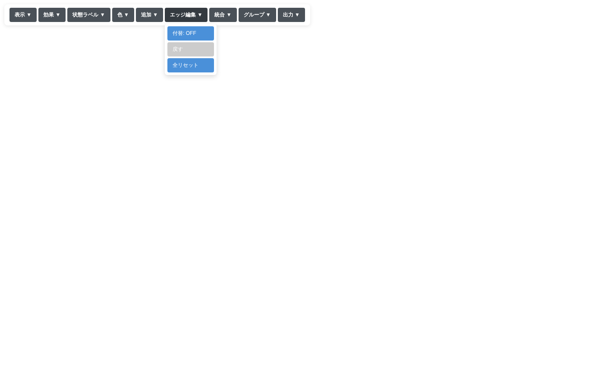

エッジの接続先を変更します。

| ボタン | 説明 |
|-------|------|
| **付替: OFF/ON** | エッジ編集モードの切替 |
| **戻す (N)** | 直前の変更を取り消し（N=履歴数） |
| **全リセット** | すべてのエッジ変更を元に戻す |

### 使用方法

1. 「付替: OFF」をクリック → 「付替: ON」（赤色）に変化
2. エッジをクリック → 編集パネルが表示
3. 新しい接続先を選択
4. 「変更を適用」をクリック

---

## 統合メニュー

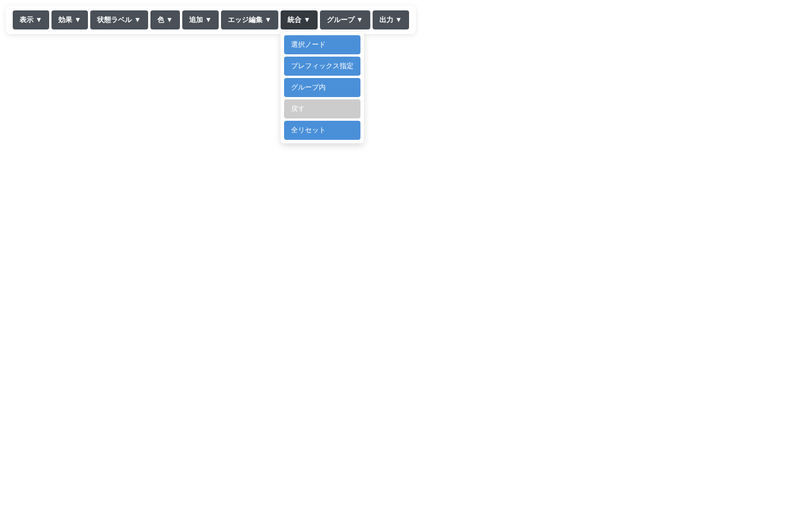

複数のノードを1つに統合して表示を簡略化します。

| ボタン | 説明 |
|-------|------|
| **選択ノード** | Ctrl+クリックで選択したノードを統合 |
| **プレフィックス指定** | 共通プレフィックスを持つノードを統合 |
| **グループ内** | SUCCESS/FAILUREグループ全体を統合 |
| **戻す (N)** | 直前の統合を取り消し |
| **全リセット** | すべての統合を元に戻す |

### 統合されたノードの特徴

- 紫色で表示
- 接続エッジのラベルは「Any」に統一
- 元のノード情報はクリック時に表示

### 使用例: プレフィックス指定

1. 「プレフィックス指定」をクリック
2. プレフィックスを入力（例: `api.response`）
3. 対象ノードがプレビュー表示
4. 「まとめる」をクリック

---

## グループメニュー

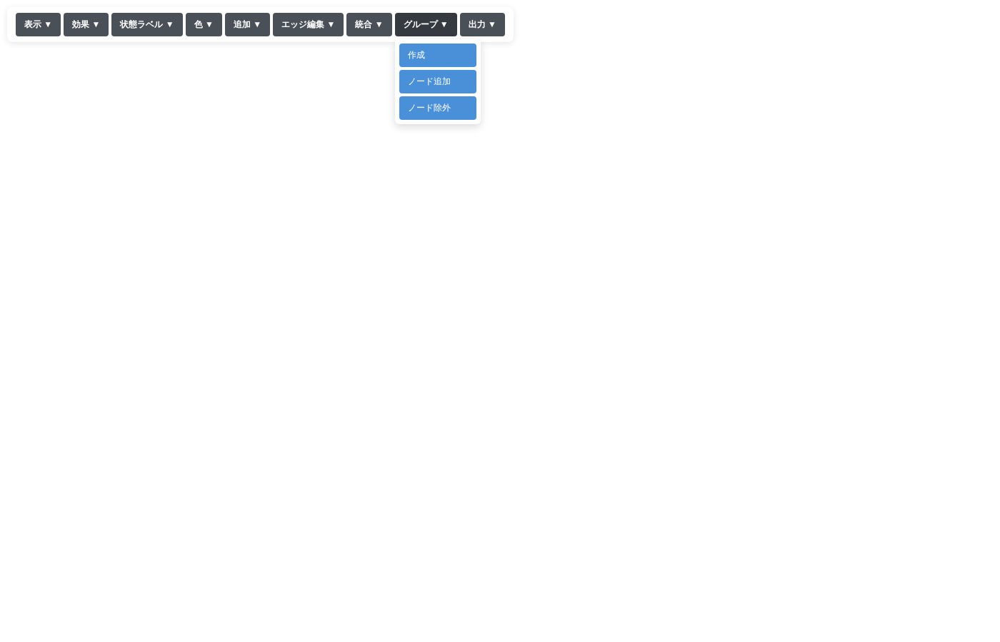

ノードを視覚的にグループ化します（YAML構造には影響しません）。

| ボタン | 説明 |
|-------|------|
| **作成** | 選択したノードで新しいグループを作成 |
| **ノード追加** | 選択したノードを既存グループに追加 |
| **ノード除外** | 選択したノードをグループから除外 |

### グループ作成

1. Ctrl+クリックでノードを選択
2. 「作成」をクリック
3. グループ名と色を指定
4. 「作成」をクリック

### 既存グループ

- **SUCCESS**: `exit.success.*` ノードを含む緑色の枠
- **FAILURE**: `exit.failure.*` ノードを含む赤色の枠

これらのグループにもノードを追加できます。

---

## 出力メニュー

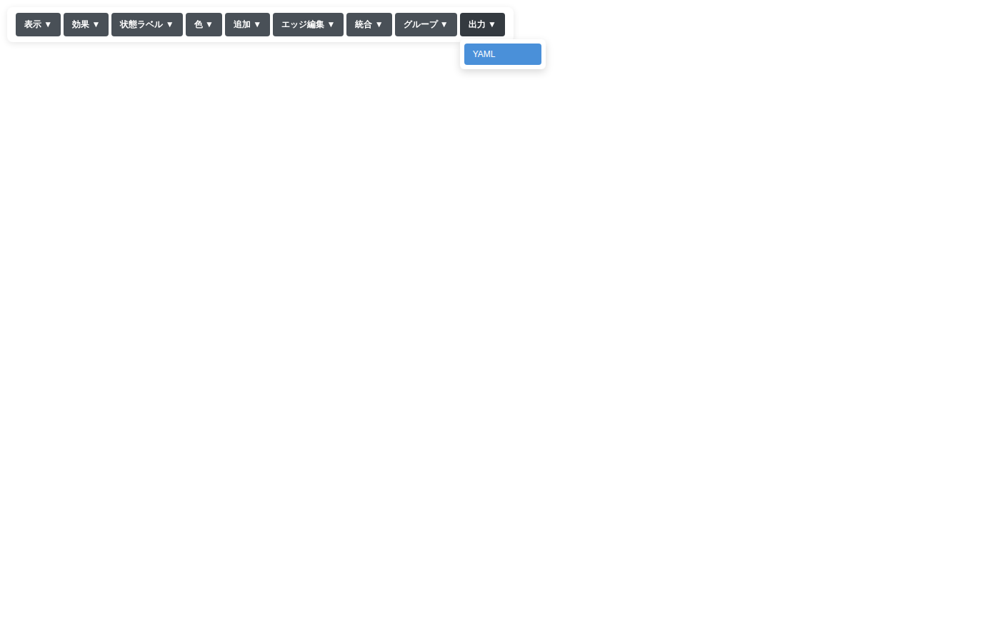

現在の表示状態をYAMLファイルとして出力します。

| ボタン | 説明 |
|-------|------|
| **YAML** | YAMLファイルをダウンロード |

### 出力されるYAML

- ファイル名: `dag_export_YYYYMMDD_HHMMSS.yaml`
- 非表示にしたノード/エッジは出力されない
- エッジの付け替えが反映される
- 追加したノード/エッジが含まれる

---

## 情報パネル

ノードまたはエッジをクリックすると、画面左下に情報パネルが表示されます。

### ノード情報

- ノードタイプ（START/PROCESS/SUCCESS/FAILURE）
- ノードID
- 説明

### エッジ情報

- 接続元 → 接続先
- ラベル（状態名）

---

## キーボードショートカット

| 操作 | 説明 |
|-----|------|
| Ctrl+クリック | 複数選択 |
| マウスホイール | ズームイン/アウト |
| ドラッグ（背景） | パン |
| ドラッグ（ノード） | ノード移動 |

---

## トラブルシューティング

### ノードが重なる

「表示」→「リセット」でレイアウトを再計算してください。

### 変更を元に戻したい

各機能には「戻す」「全リセット」ボタンがあります：
- エッジ編集: 「戻す」「全リセット」
- 統合: 「戻す」「全リセット」

### 非表示にした要素を戻したい

「効果」→「復元」をクリックしてください。
