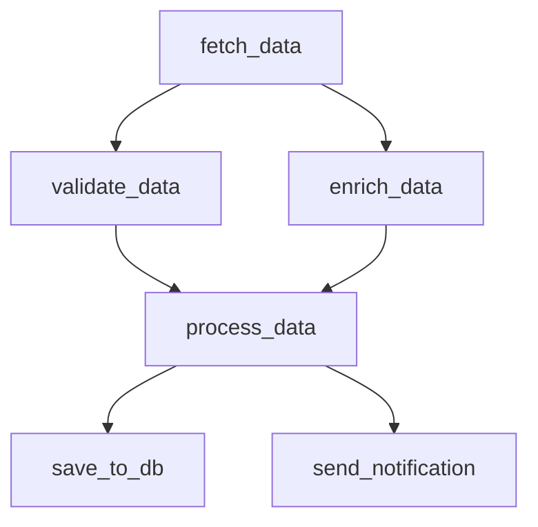

# Railway Framework for Python - 仕様書

## 1. システムアーキテクチャ

### 1.1 全体アーキテクチャ

```
┌─────────────────────────────────────────────────────────────┐
│                        CLI Layer                             │
│  (railway コマンド: Typer ベース)                              │
└─────────────────────────────────────────────────────────────┘
                              │
                              ▼
┌─────────────────────────────────────────────────────────────┐
│                    Template Engine                           │
│  (プロジェクト/ノード/エントリーポイント生成)                      │
└─────────────────────────────────────────────────────────────┘
                              │
                              ▼
┌─────────────────────────────────────────────────────────────┐
│                  User Project Layer                          │
│  ┌─────────────┐  ┌──────────────┐  ┌──────────────┐      │
│  │Entry Points │  │    Nodes     │  │   Common     │      │
│  │  (src/*.py) │──│(src/nodes/)  │──│(src/common/) │      │
│  └─────────────┘  └──────────────┘  └──────────────┘      │
│         │                │                   │               │
│         └────────────────┴───────────────────┘               │
│                          │                                    │
└──────────────────────────┼────────────────────────────────────┘
                           │
                           ▼
┌─────────────────────────────────────────────────────────────┐
│                     Core Libraries                           │
│  ┌──────────┐  ┌──────────┐  ┌──────────┐  ┌──────────┐  │
│  │ returns  │  │tenacity  │  │ pydantic │  │  loguru  │  │
│  │  (ROP)   │  │(Retry)   │  │(Settings)│  │(Logging) │  │
│  └──────────┘  └──────────┘  └──────────┘  └──────────┘  │
└─────────────────────────────────────────────────────────────┘
```

### 1.2 データフロー

```
[.env] ────┐
           ├─→ [settings.py] ─→ [Settings Object]
[config/]──┘                            │
                                        ▼
[Entry Point] ───→ [Node1] ───→ [Node2] ───→ [Node3]
      │              │            │             │
      │         Result<T, E>  Result<T, E>  Result<T, E>
      │              │            │             │
      └──────────────┴────────────┴─────────────┘
                     │
                     ▼
              [Success/Failure]
                     │
                     ├─→ [Logger (loguru)]
                     └─→ [Metrics (optional)]
```

### 1.3 Railway パイプライン実行フロー

```
Success Track:  ════════════════════════════════════════════
                fetch_data ──> validate ──> transform ──> save
                    │              │            │          │
                    ✓              ✓            ✓          ✓

Failure Track:  ════════════════════════════════════════════
                fetch_data ──> validate ──> transform ──> save
                    │              │
                    ✓              ✗ (Error!)
                                   │
                    ┌──────────────┘
                    └──> スキップ ──> スキップ ──> Failure(Error)
```

## 2. モジュール構成

### 2.1 フレームワークコア (railway パッケージ)

```
railway/
├── __init__.py                  # パッケージ初期化
├── cli/                         # CLIコマンド実装
│   ├── __init__.py
│   ├── main.py                  # railway コマンドエントリーポイント
│   ├── init.py                  # railway init 実装
│   ├── entry.py                 # railway add-entry/list-entries
│   ├── node.py                  # railway add-node/list-nodes
│   ├── graph.py                 # railway graph サブコマンド群
│   └── info.py                  # railway info 実装
├── templates/                   # テンプレートファイル群
│   ├── project/                 # プロジェクトテンプレート
│   │   ├── pyproject.toml.jinja
│   │   ├── .env.example.jinja
│   │   ├── .gitignore.jinja
│   │   ├── README.md.jinja
│   │   ├── .ruff.toml.jinja
│   │   └── settings.py.jinja
│   ├── entry/                   # エントリーポイントテンプレート
│   │   ├── sync_entry.py.jinja
│   │   └── async_entry.py.jinja
│   ├── node/                    # ノードテンプレート
│   │   ├── node.py.jinja
│   │   └── test_node.py.jinja
│   ├── config/                  # 設定ファイルテンプレート
│   │   ├── app.yaml.jinja
│   │   ├── logging.yaml.jinja
│   │   └── retry.yaml.jinja
│   └── ci/                      # CI/CDテンプレート
│       └── github_actions.yml.jinja
├── core/                        # コアロジック
│   ├── __init__.py
│   ├── errors.py                # エラー型定義
│   ├── decorators.py            # カスタムデコレータ
│   ├── graph.py                 # グラフ解析・実行
│   ├── observability.py         # メトリクス・モニタリング
│   └── di.py                    # 依存性注入 (optional)
└── utils/                       # ユーティリティ
    ├── __init__.py
    ├── file_ops.py              # ファイル操作
    ├── validation.py            # バリデーション
    └── yaml_loader.py           # YAML読み込み
```

### 2.2 ユーザープロジェクト構造

```
{project_name}/
├── src/
│   ├── __init__.py
│   ├── settings.py              # 設定読み込み・初期化
│   ├── {entry_name}.py          # エントリーポイント (複数可)
│   ├── nodes/                   # 処理ノード
│   │   ├── __init__.py
│   │   ├── {node_name}.py       # 各ノード実装
│   │   └── ...
│   └── common/                  # 共通ライブラリ
│       ├── __init__.py
│       ├── api_client.py        # API呼び出しユーティリティ
│       ├── db_client.py         # DB接続ユーティリティ
│       └── ...
├── tests/
│   ├── __init__.py
│   ├── conftest.py              # pytest フィクスチャ
│   ├── test_{entry_name}.py     # エントリーポイントテスト
│   └── nodes/
│       ├── __init__.py
│       └── test_{node_name}.py  # ノード単位テスト
├── config/
│   ├── development/
│   │   ├── app.yaml
│   │   ├── logging.yaml
│   │   └── retry.yaml
│   ├── staging/
│   │   └── ...
│   └── production/
│       └── ...
├── logs/                        # ログ出力先 (自動生成)
├── .env                         # 環境変数 (gitignore対象)
├── .env.example                 # 環境変数テンプレート
├── .gitignore
├── .ruff.toml                   # Ruff設定
├── pyproject.toml               # プロジェクト設定
└── README.md
```

## 3. 詳細仕様

### 3.1 settings.py 実装仕様

#### 3.1.1 モジュール構成

```python
# src/settings.py
from pathlib import Path
from typing import Any, Dict
from pydantic import BaseModel, Field
from pydantic_settings import BaseSettings, SettingsConfigDict
import yaml


class APISettings(BaseModel):
    """API関連設定"""
    base_url: str
    timeout: int = 30
    max_retries: int = 3


class DatabaseSettings(BaseModel):
    """データベース関連設定"""
    host: str
    port: int
    name: str
    user: str | None = None
    password: str | None = None


class RetrySettings(BaseModel):
    """リトライポリシー設定"""
    max_attempts: int = 3
    multiplier: int = 1
    min_wait: int = 2
    max_wait: int = 10

    # ノード別設定 (optional)
    nodes: Dict[str, Dict[str, int]] = Field(default_factory=dict)


class LoggingSettings(BaseModel):
    """ロギング設定"""
    level: str = "INFO"
    format: str
    handlers: list[Dict[str, Any]] = Field(default_factory=list)


class Settings(BaseSettings):
    """グローバル設定オブジェクト"""

    model_config = SettingsConfigDict(
        env_file=".env",
        env_file_encoding="utf-8",
        case_sensitive=False,
        extra="allow"
    )

    # 環境変数から読み込む値
    railway_env: str = "development"
    app_name: str
    log_level: str = "INFO"

    # YAML から読み込む値
    api: APISettings | None = None
    database: DatabaseSettings | None = None
    retry: RetrySettings
    logging: LoggingSettings

    def __init__(self, **kwargs):
        """初期化時にYAML設定を読み込み"""
        super().__init__(**kwargs)
        self._load_yaml_configs()

    def _load_yaml_configs(self) -> None:
        """環境別YAML設定ファイルを読み込み"""
        config_dir = Path(__file__).parent.parent / "config" / self.railway_env

        # app.yaml
        app_config_path = config_dir / "app.yaml"
        if app_config_path.exists():
            with open(app_config_path, "r", encoding="utf-8") as f:
                app_config = yaml.safe_load(f)
                if app_config:
                    if "api" in app_config:
                        self.api = APISettings(**app_config["api"])
                    if "database" in app_config:
                        self.database = DatabaseSettings(**app_config["database"])

        # retry.yaml
        retry_config_path = config_dir / "retry.yaml"
        if retry_config_path.exists():
            with open(retry_config_path, "r", encoding="utf-8") as f:
                retry_config = yaml.safe_load(f)
                if retry_config:
                    self.retry = RetrySettings(**retry_config)

        # logging.yaml
        logging_config_path = config_dir / "logging.yaml"
        if logging_config_path.exists():
            with open(logging_config_path, "r", encoding="utf-8") as f:
                logging_config = yaml.safe_load(f)
                if logging_config:
                    self.logging = LoggingSettings(**logging_config)


# グローバル設定インスタンス
settings = Settings()
```

#### 3.1.2 使用例

```python
from src.settings import settings

# 環境変数から読み込んだ値
print(settings.railway_env)  # "development"
print(settings.app_name)     # "my_automation"

# YAML から読み込んだ値
print(settings.api.base_url)        # "https://api.example.com"
print(settings.retry.max_attempts)  # 3

# ノード別リトライ設定
node_config = settings.retry.nodes.get("fetch_data", {})
max_attempts = node_config.get("max_attempts", settings.retry.max_attempts)
```

### 3.2 エントリーポイント実装仕様

#### 3.2.1 同期版エントリーポイントテンプレート

```python
# src/{entry_name}.py
"""
{entry_name} entry point.
Generated by railway add-entry {entry_name}
"""
from returns.result import Result, Success, Failure
from returns.pipeline import flow
from loguru import logger
import typer
from typing import Optional

from src.nodes.{node1_name} import {node1_name}
from src.nodes.{node2_name} import {node2_name}
from src.nodes.{node3_name} import {node3_name}
from src.settings import settings

app = typer.Typer()


def run_pipeline() -> Result[str, Exception]:
    """
    Execute the {entry_name} pipeline.

    Returns:
        Result[str, Exception]: Success with result message or Failure with error
    """
    logger.info("Starting {entry_name} pipeline...")

    return flow(
        {node1_name}(),
        {node2_name},
        {node3_name},
    )


@app.command()
def main(
    # コマンドライン引数のプレースホルダ
    date: Optional[str] = typer.Option(None, help="Target date (YYYY-MM-DD)"),
    dry_run: bool = typer.Option(False, "--dry-run", help="Dry run mode (no actual execution)"),
    verbose: bool = typer.Option(False, "--verbose", "-v", help="Verbose output"),
) -> None:
    """
    {entry_name} entry point.

    Args:
        date: Target date for processing
        dry_run: If True, perform dry run without actual execution
        verbose: If True, enable verbose logging
    """
    # ログレベル設定
    if verbose:
        logger.remove()
        logger.add(lambda msg: print(msg, end=""), level="DEBUG")

    logger.info(f"Starting {entry_name} (env={settings.railway_env}, dry_run={dry_run})")

    if dry_run:
        logger.warning("Running in DRY RUN mode - no actual changes will be made")

    # パイプライン実行
    result = run_pipeline()

    # 結果処理
    result.map(lambda x: logger.success(f"✓ Pipeline completed successfully: {x}"))
    result.alt(lambda e: logger.error(f"✗ Pipeline failed: {e}"))

    # 終了コード
    if result.is_failure:
        raise typer.Exit(code=1)


if __name__ == "__main__":
    app()
```

#### 3.2.2 非同期版エントリーポイントテンプレート

```python
# src/{entry_name}.py (async version)
"""
{entry_name} entry point (async).
Generated by railway add-entry {entry_name} --async
"""
import asyncio
from returns.future import FutureResult
from returns.io import impure_safe
from loguru import logger
import typer
from typing import Optional

from src.nodes.{node1_name} import {node1_name}
from src.nodes.{node2_name} import {node2_name}
from src.settings import settings

app = typer.Typer()


async def run_pipeline_async() -> FutureResult[str, Exception]:
    """
    Execute the {entry_name} pipeline asynchronously.

    Returns:
        FutureResult[str, Exception]: Future result of the pipeline
    """
    logger.info("Starting {entry_name} pipeline (async)...")

    # 非同期パイプライン実行
    result1 = await {node1_name}()
    if result1.is_failure:
        return FutureResult.from_failure(result1.failure())

    result2 = await {node2_name}(result1.unwrap())
    if result2.is_failure:
        return FutureResult.from_failure(result2.failure())

    return FutureResult.from_value(result2.unwrap())


@app.command()
def main(
    date: Optional[str] = typer.Option(None, help="Target date (YYYY-MM-DD)"),
    dry_run: bool = typer.Option(False, "--dry-run", help="Dry run mode"),
    verbose: bool = typer.Option(False, "--verbose", "-v", help="Verbose output"),
) -> None:
    """
    {entry_name} entry point (async version).
    """
    if verbose:
        logger.remove()
        logger.add(lambda msg: print(msg, end=""), level="DEBUG")

    logger.info(f"Starting {entry_name} (async, env={settings.railway_env}, dry_run={dry_run})")

    # 非同期処理実行
    result = asyncio.run(run_pipeline_async())

    # 結果処理
    if result.is_success:
        logger.success(f"✓ Pipeline completed successfully: {result.unwrap()}")
    else:
        logger.error(f"✗ Pipeline failed: {result.failure()}")
        raise typer.Exit(code=1)


if __name__ == "__main__":
    app()
```

### 3.3 ノード実装仕様

#### 3.3.1 ノードテンプレート

```python
# src/nodes/{node_name}.py
"""
{node_name} node.
Generated by railway add-node {node_name}
"""
from returns.result import Result, Success, Failure, safe
from tenacity import retry, stop_after_attempt, wait_exponential
from loguru import logger
from typing import Any, Dict

from src.settings import settings


@retry(
    stop=stop_after_attempt(settings.retry.max_attempts),
    wait=wait_exponential(
        multiplier=settings.retry.multiplier,
        min=settings.retry.min_wait,
        max=settings.retry.max_wait
    )
)
@safe
def {node_name}(input_data: Dict[str, Any]) -> Dict[str, Any]:
    """
    {node_name} processing node.

    Args:
        input_data: Input data from previous node

    Returns:
        Result[Dict[str, Any], Exception]: Processed data or error

    Raises:
        Exception: Any exception will be caught by @safe decorator

    Example:
        >>> result = {node_name}({{"key": "value"}})
        >>> assert result.is_success
        >>> data = result.unwrap()
    """
    logger.info(f"Executing {node_name}...")

    # TODO: Implement your processing logic here
    # Example:
    # processed_data = {{
    #     "original": input_data,
    #     "processed_at": datetime.now().isoformat(),
    # }}

    processed_data = input_data  # Placeholder

    logger.debug(f"{node_name} completed: {{processed_data}}")
    return processed_data
```

#### 3.3.2 非同期ノードテンプレート

```python
# src/nodes/{node_name}.py (async version)
"""
{node_name} async node.
Generated by railway add-node {node_name} --async
"""
import asyncio
from returns.future import FutureResult
from returns.io import impure_safe
from tenacity import retry, stop_after_attempt, wait_exponential
from loguru import logger
from typing import Any, Dict

from src.settings import settings


@retry(
    stop=stop_after_attempt(settings.retry.max_attempts),
    wait=wait_exponential(
        multiplier=settings.retry.multiplier,
        min=settings.retry.min_wait,
        max=settings.retry.max_wait
    )
)
async def {node_name}(input_data: Dict[str, Any]) -> FutureResult[Dict[str, Any], Exception]:
    """
    {node_name} async processing node.

    Args:
        input_data: Input data from previous node

    Returns:
        FutureResult[Dict[str, Any], Exception]: Future result with processed data or error
    """
    logger.info(f"Executing {node_name} (async)...")

    try:
        # TODO: Implement your async processing logic here
        await asyncio.sleep(0.1)  # Placeholder async operation

        processed_data = input_data

        logger.debug(f"{node_name} completed: {{processed_data}}")
        return FutureResult.from_value(processed_data)

    except Exception as e:
        logger.error(f"{node_name} failed: {{e}}")
        return FutureResult.from_failure(e)
```

### 3.4 テストテンプレート実装仕様

#### 3.4.1 ノードテストテンプレート

```python
# tests/nodes/test_{node_name}.py
"""
Tests for {node_name} node.
Generated by railway add-node {node_name}
"""
import pytest
from returns.result import Success, Failure
from unittest.mock import Mock, patch, MagicMock

from src.nodes.{node_name} import {node_name}


class Test{NodeName}:
    """Test suite for {node_name} node."""

    def test_{node_name}_success(self):
        """正常系: {node_name}が正常に処理を完了"""
        # Arrange
        input_data = {{"key": "value", "count": 10}}

        # Act
        result = {node_name}(input_data)

        # Assert
        assert result.is_success
        output_data = result.unwrap()
        assert isinstance(output_data, dict)
        # TODO: Add your specific assertions here

    def test_{node_name}_with_empty_input(self):
        """境界値: 空の入力データ"""
        # Arrange
        input_data = {{}}

        # Act
        result = {node_name}(input_data)

        # Assert
        # TODO: Define expected behavior for empty input
        assert result.is_success or result.is_failure

    def test_{node_name}_with_invalid_input(self):
        """異常系: 不正な入力データ"""
        # Arrange
        input_data = None

        # Act
        result = {node_name}(input_data)

        # Assert
        assert result.is_failure
        error = result.failure()
        assert error is not None

    @patch('src.nodes.{node_name}.some_dependency')
    def test_{node_name}_with_mock(self, mock_dependency):
        """モックを使用したテスト"""
        # Arrange
        mock_dependency.return_value = {{"mocked": True}}
        input_data = {{"key": "value"}}

        # Act
        result = {node_name}(input_data)

        # Assert
        assert result.is_success
        mock_dependency.assert_called_once()

    def test_{node_name}_retry_behavior(self):
        """リトライ動作の確認"""
        # TODO: Implement retry behavior test
        # This should verify that the node retries on transient failures
        pass


@pytest.fixture
def sample_input():
    """テスト用サンプルデータ"""
    return {{
        "id": 1,
        "name": "test",
        "value": 100
    }}


def test_{node_name}_with_fixture(sample_input):
    """フィクスチャを使用したテスト"""
    result = {node_name}(sample_input)
    assert result.is_success
```

#### 3.4.2 統合テストテンプレート

```python
# tests/test_{entry_name}.py
"""
Integration tests for {entry_name} pipeline.
"""
import pytest
from returns.result import Success, Failure
from unittest.mock import patch, MagicMock

from src.{entry_name} import run_pipeline


class Test{EntryName}Integration:
    """Integration test suite for {entry_name} pipeline."""

    def test_full_pipeline_success(self, monkeypatch):
        """統合テスト: パイプライン全体が正常に実行される"""
        # Arrange: モックデータ設定
        test_data_1 = {{"stage": 1, "data": "test"}}
        test_data_2 = {{"stage": 2, "data": "processed"}}
        test_data_3 = {{"stage": 3, "data": "final"}}

        # 各ノードをモック化
        monkeypatch.setattr(
            'src.nodes.node1.node1',
            lambda: Success(test_data_1)
        )
        monkeypatch.setattr(
            'src.nodes.node2.node2',
            lambda x: Success(test_data_2)
        )
        monkeypatch.setattr(
            'src.nodes.node3.node3',
            lambda x: Success(test_data_3)
        )

        # Act
        result = run_pipeline()

        # Assert
        assert result.is_success
        final_data = result.unwrap()
        assert final_data == test_data_3

    def test_pipeline_failure_in_middle(self, monkeypatch):
        """統合テスト: 途中でエラーが発生した場合"""
        # Arrange
        test_error = Exception("Node2 failed")

        monkeypatch.setattr(
            'src.nodes.node1.node1',
            lambda: Success({{"stage": 1}})
        )
        monkeypatch.setattr(
            'src.nodes.node2.node2',
            lambda x: Failure(test_error)
        )

        # Act
        result = run_pipeline()

        # Assert
        assert result.is_failure
        error = result.failure()
        assert str(error) == "Node2 failed"

    def test_pipeline_with_settings(self, monkeypatch):
        """統合テスト: 設定値が正しく使用される"""
        # TODO: Implement settings integration test
        pass
```

### 3.5 設定ファイル仕様

#### 3.5.1 .env ファイル

```env
# Environment specification (development/staging/production)
RAILWAY_ENV=development

# Application settings
APP_NAME=my_automation
LOG_LEVEL=INFO

# API credentials (example)
# API_KEY=your_api_key_here
# API_SECRET=your_api_secret_here

# Database credentials (example)
# DB_USER=postgres
# DB_PASSWORD=secret
```

#### 3.5.2 config/development/app.yaml

```yaml
# Application configuration for development environment

# API settings
api:
  base_url: "https://api.example.com"
  timeout: 30
  max_retries: 3

# Database settings
database:
  host: "localhost"
  port: 5432
  name: "dev_db"
  # user and password should be set in .env

# Notification settings
notification:
  email_enabled: false
  email_to: "dev@example.com"
  slack_webhook: ""

# Feature flags
features:
  enable_cache: true
  enable_metrics: false
```

#### 3.5.3 config/development/logging.yaml

```yaml
# Logging configuration for development environment

# Log level (DEBUG, INFO, WARNING, ERROR, CRITICAL)
level: "DEBUG"

# Log format
format: "<green>{time:YYYY-MM-DD HH:mm:ss}</green> | <level>{level: <8}</level> | <cyan>{name}</cyan>:<cyan>{function}</cyan>:<cyan>{line}</cyan> | <level>{message}</level>"

# Log handlers
handlers:
  # File handler
  - sink: "logs/app.log"
    rotation: "1 day"
    retention: "7 days"
    level: "INFO"
    encoding: "utf-8"

  # Error file handler
  - sink: "logs/error.log"
    rotation: "1 day"
    retention: "30 days"
    level: "ERROR"
    encoding: "utf-8"

  # Console handler (stderr)
  - sink: "stderr"
    level: "DEBUG"
    colorize: true

# Serialization for structured logging (optional)
serialize: false

# Backtrace and diagnosis
backtrace: true
diagnose: true
```

#### 3.5.4 config/development/retry.yaml

```yaml
# Retry policy configuration for development environment

# Default retry settings
max_attempts: 3
multiplier: 1
min_wait: 2  # seconds
max_wait: 10  # seconds

# Node-specific retry settings
nodes:
  fetch_data:
    max_attempts: 5
    multiplier: 1
    min_wait: 1
    max_wait: 5

  send_notification:
    max_attempts: 2
    multiplier: 2
    min_wait: 3
    max_wait: 15

  api_call:
    max_attempts: 4
    multiplier: 1
    min_wait: 2
    max_wait: 8
```

#### 3.5.5 config/production/app.yaml

```yaml
# Application configuration for production environment

api:
  base_url: "https://api.production.example.com"
  timeout: 60
  max_retries: 5

database:
  host: "db.production.example.com"
  port: 5432
  name: "prod_db"

notification:
  email_enabled: true
  email_to: "ops@example.com"
  slack_webhook: "https://hooks.slack.com/services/YOUR/WEBHOOK/URL"

features:
  enable_cache: true
  enable_metrics: true
```

#### 3.5.6 config/production/logging.yaml

```yaml
# Logging configuration for production environment

level: "INFO"

format: "{time:YYYY-MM-DD HH:mm:ss} | {level: <8} | {name}:{function}:{line} | {message}"

handlers:
  - sink: "logs/app.log"
    rotation: "1 day"
    retention: "30 days"
    level: "INFO"
    encoding: "utf-8"

  - sink: "logs/error.log"
    rotation: "1 day"
    retention: "90 days"
    level: "ERROR"
    encoding: "utf-8"

  # JSON structured logging for production
  - sink: "logs/structured.log"
    rotation: "1 day"
    retention: "30 days"
    level: "INFO"
    serialize: true
    encoding: "utf-8"

serialize: false
backtrace: false
diagnose: false
```

### 3.6 CLIコマンド詳細仕様

#### 3.6.1 railway init コマンド

**シグネチャ:**
```python
def init(
    project_name: str = typer.Argument(..., help="Project name"),
    template: str = typer.Option("default", help="Template type (default/minimal)"),
    python_version: str = typer.Option("3.10", help="Minimum Python version"),
) -> None:
```

**動作:**
1. `{project_name}` ディレクトリを作成
2. 以下のディレクトリ構造を生成:
   - `src/`, `tests/`, `config/development/`, `config/production/`, `logs/`
3. テンプレートファイルをレンダリングして配置:
   - `pyproject.toml` (プロジェクト名、Python バージョンを埋め込み)
   - `.env.example`
   - `.gitignore`
   - `README.md`
   - `.ruff.toml`
   - `src/settings.py`
4. 設定ファイルのテンプレート配置:
   - `config/development/*.yaml`
   - `config/production/*.yaml`
5. 成功メッセージ出力

**出力例:**
```
✓ Created project directory: my_automation
✓ Generated project structure
✓ Created configuration files
✓ Project initialization complete!

Next steps:
  1. cd my_automation
  2. cp .env.example .env
  3. railway add-entry my_first_entry
  4. uv sync
```

#### 3.6.2 railway add-entry コマンド

**シグネチャ:**
```python
def add_entry(
    name: str = typer.Argument(..., help="Entry point name (snake_case)"),
    async_mode: bool = typer.Option(False, "--async", help="Generate async version"),
    nodes: list[str] = typer.Option(None, "--node", "-n", help="Initial nodes to include"),
) -> None:
```

**動作:**
1. 入力バリデーション:
   - `name` が snake_case であることを確認
   - `src/{name}.py` が既に存在しないことを確認
2. テンプレート選択:
   - `async_mode=True` の場合: `async_entry.py.jinja`
   - `async_mode=False` の場合: `sync_entry.py.jinja`
3. ノード指定がある場合、import文とflow定義に追加
4. `src/{name}.py` を生成
5. 成功メッセージ出力

**出力例:**
```
✓ Created entry point: src/daily_report.py
✓ Entry point is ready to use

To run:
  uv run python -m src.daily_report --help
```

#### 3.6.3 railway add-node コマンド

**シグネチャ:**
```python
def add_node(
    name: str = typer.Argument(..., help="Node name (snake_case)"),
    async_mode: bool = typer.Option(False, "--async", help="Generate async version"),
    with_test: bool = typer.Option(True, help="Generate test file"),
) -> None:
```

**動作:**
1. 入力バリデーション
2. `src/nodes/{name}.py` を生成
3. `with_test=True` の場合、`tests/nodes/test_{name}.py` も生成
4. 成功メッセージ出力

**出力例:**
```
✓ Created node: src/nodes/fetch_data.py
✓ Created test: tests/nodes/test_fetch_data.py

Node is ready to use. Import it in your entry point:
  from src.nodes.fetch_data import fetch_data
```

#### 3.6.4 railway list-entries コマンド

**シグネチャ:**
```python
def list_entries() -> None:
```

**動作:**
1. `src/` ディレクトリ内の `.py` ファイルをスキャン
2. `__init__.py`, `settings.py` を除外
3. ファイルの docstring を読み取り
4. テーブル形式で出力

**出力例:**
```
Entry Points:
┏━━━━━━━━━━━━━━━┳━━━━━━━━━━━━━━━━━━━━━━━━━━━━━━━━━━━━━┓
┃ Name          ┃ Description                         ┃
┡━━━━━━━━━━━━━━━╇━━━━━━━━━━━━━━━━━━━━━━━━━━━━━━━━━━━━━┩
│ daily_report  │ Generate and send daily report      │
│ weekly_batch  │ Weekly batch processing             │
└───────────────┴─────────────────────────────────────┘

Total: 2 entry points
```

#### 3.6.5 railway list-nodes コマンド

**シグネチャ:**
```python
def list_nodes() -> None:
```

**動作:**
1. `src/nodes/` ディレクトリ内の `.py` ファイルをスキャン
2. テーブル形式で出力

**出力例:**
```
Nodes:
┏━━━━━━━━━━━━━━━━━━┳━━━━━━━━━━━━━━━━━━━━━━━━━━━━━━━━━━━┓
┃ Name             ┃ Description                       ┃
┡━━━━━━━━━━━━━━━━━━╇━━━━━━━━━━━━━━━━━━━━━━━━━━━━━━━━━━━┩
│ fetch_data       │ Fetch data from external API      │
│ process_data     │ Process and transform data        │
│ send_report      │ Send report via email/Slack       │
└──────────────────┴───────────────────────────────────┘

Total: 3 nodes
```

#### 3.6.6 railway info コマンド

**シグネチャ:**
```python
def info() -> None:
```

**動作:**
1. プロジェクトルートディレクトリを検出
2. `pyproject.toml` から情報を読み取り
3. 環境設定、ノード数などを表示

**出力例:**
```
Project Information:
  Name: my_automation
  Python: >=3.10
  Railway Version: 0.1.0

Environment:
  Current: development
  Available: development, staging, production

Statistics:
  Entry Points: 2
  Nodes: 5
  Tests: 8

Configuration:
  Config Dir: config/development/
  Log Level: INFO
  Retry Max Attempts: 3
```

#### 3.6.7 railway graph validate コマンド

**シグネチャ:**
```python
def validate_graph(
    graph_file: str = typer.Option("graph.yaml", help="Graph definition file")
) -> None:
```

**動作:**
1. `graph.yaml` を読み込み
2. 構文チェック
3. ノード存在チェック
4. 循環依存チェック
5. 検証結果を出力

**出力例:**
```
Validating graph: graph.yaml

✓ Syntax is valid
✓ All nodes exist
✓ No circular dependencies found
✓ Graph is valid

Execution order:
  1. fetch_data (source)
  2. validate_data, enrich_data (parallel)
  3. process_data (transform)
  4. save_to_db, send_notification (parallel, sink)
```

#### 3.6.8 railway graph visualize コマンド

**シグネチャ:**
```python
def visualize_graph(
    graph_file: str = typer.Option("graph.yaml", help="Graph definition file"),
    output: str = typer.Option("graph.md", help="Output file"),
    format: str = typer.Option("mermaid", help="Output format (mermaid)"),
) -> None:
```

**動作:**
1. `graph.yaml` を読み込み
2. Mermaid形式のグラフを生成
3. 指定ファイルに出力

**出力例:**
```
✓ Graph visualization generated: graph.md

Preview:


### 3.7 グラフ定義仕様

#### 3.7.1 graph.yaml スキーマ

```yaml
# グラフ定義ファイル
pipeline: string  # パイプライン名 (required)

nodes:
  - name: string           # ノード名 (required, must match src/nodes/{name}.py)
    type: string           # ノードタイプ: source | transform | sink (required)
    depends_on: [string]   # 依存ノードリスト (optional, default: [])
    retry: boolean         # リトライ有効化 (optional, default: true)
    on_failure: string     # エラー時動作: stop | log_only | skip (optional, default: stop)
    timeout: integer       # タイムアウト秒数 (optional)
    parallel: boolean      # 並列実行可能 (optional, default: true)
```

#### 3.7.2 graph.yaml 例

```yaml
pipeline: data_processing_pipeline

nodes:
  # ソースノード (データ取得)
  - name: fetch_data
    type: source
    retry: true
    timeout: 60

  # トランスフォームノード (データ変換)
  - name: validate_data
    type: transform
    depends_on: [fetch_data]
    retry: false

  - name: enrich_data
    type: transform
    depends_on: [fetch_data]
    retry: true

  - name: process_data
    type: transform
    depends_on: [validate_data, enrich_data]

  # シンクノード (データ保存・送信)
  - name: save_to_db
    type: sink
    depends_on: [process_data]
    retry: true
    on_failure: stop

  - name: send_notification
    type: sink
    depends_on: [process_data]
    retry: true
    on_failure: log_only  # 通知失敗してもパイプラインは続行
```

### 3.8 カスタムエラー型仕様

#### 3.8.1 エラー階層

```python
# railway/core/errors.py
from typing import Any, Optional


class RailwayError(Exception):
    """Base error class for Railway framework."""

    def __init__(
        self,
        message: str,
        *,
        error_code: Optional[str] = None,
        context: Optional[dict[str, Any]] = None,
    ):
        super().__init__(message)
        self.message = message
        self.error_code = error_code
        self.context = context or {}

    def __str__(self) -> str:
        if self.error_code:
            return f"[{self.error_code}] {self.message}"
        return self.message


class RetryableError(RailwayError):
    """Error that can be retried."""
    pass


class FatalError(RailwayError):
    """Error that should not be retried."""
    pass


# Domain-specific errors

class ConfigurationError(FatalError):
    """Configuration related error."""
    pass


class ValidationError(FatalError):
    """Data validation error."""
    pass


class APIError(RetryableError):
    """External API error."""
    pass


class NetworkError(RetryableError):
    """Network connectivity error."""
    pass


class TimeoutError(RetryableError):
    """Operation timeout error."""
    pass


class DatabaseError(RetryableError):
    """Database operation error."""
    pass
```

#### 3.8.2 使用例

```python
from railway.core.errors import ValidationError, APIError

@safe
def validate_user_input(data: dict) -> dict:
    """Validate user input data."""
    if not data.get("email"):
        raise ValidationError(
            "Email is required",
            error_code="VALIDATION_001",
            context={"data": data}
        )
    return data

@retry(
    stop=stop_after_attempt(3),
    retry=retry_if_exception_type(APIError)
)
@safe
def call_external_api(url: str) -> dict:
    """Call external API with retry on APIError."""
    response = requests.get(url)
    if response.status_code >= 500:
        raise APIError(
            f"API returned {response.status_code}",
            error_code="API_ERROR",
            context={"url": url, "status": response.status_code}
        )
    return response.json()
```

### 3.9 オブザーバビリティ機能仕様

#### 3.9.1 メトリクスデコレータ

```python
# railway/core/observability.py
import time
import functools
from typing import Callable, TypeVar, ParamSpec
from loguru import logger

P = ParamSpec('P')
T = TypeVar('T')


def measure_time(func: Callable[P, T]) -> Callable[P, T]:
    """
    Measure and log execution time of a function.

    Usage:
        @measure_time
        def my_function():
            pass
    """
    @functools.wraps(func)
    def wrapper(*args: P.args, **kwargs: P.kwargs) -> T:
        start_time = time.time()
        logger.debug(f"Starting {func.__name__}...")

        try:
            result = func(*args, **kwargs)
            elapsed = time.time() - start_time
            logger.info(f"✓ {func.__name__} completed in {elapsed:.2f}s")
            return result
        except Exception as e:
            elapsed = time.time() - start_time
            logger.error(f"✗ {func.__name__} failed after {elapsed:.2f}s: {e}")
            raise

    return wrapper


def track_errors(func: Callable[P, T]) -> Callable[P, T]:
    """
    Track and log errors with context.

    Usage:
        @track_errors
        def my_function():
            pass
    """
    @functools.wraps(func)
    def wrapper(*args: P.args, **kwargs: P.kwargs) -> T:
        try:
            return func(*args, **kwargs)
        except Exception as e:
            logger.exception(
                f"Error in {func.__name__}: {e}",
                extra={
                    "function": func.__name__,
                    "args": args,
                    "kwargs": kwargs,
                }
            )
            raise

    return wrapper


# Combined decorator
def railway_node(func: Callable[P, T]) -> Callable[P, T]:
    """
    Composite decorator for railway nodes.
    Combines measure_time and track_errors.

    Usage:
        @railway_node
        def my_node(data):
            return process(data)
    """
    return measure_time(track_errors(func))
```

## 4. pyproject.toml 仕様

```toml
[project]
name = "{project_name}"
version = "0.1.0"
description = "Railway framework automation project"
readme = "README.md"
requires-python = ">={python_version}"
dependencies = [
    "returns>=0.22.0",
    "tenacity>=8.2.0",
    "pydantic>=2.5.0",
    "pydantic-settings>=2.1.0",
    "typer>=0.9.0",
    "loguru>=0.7.0",
    "python-dotenv>=1.0.0",
    "PyYAML>=6.0",
]

[project.optional-dependencies]
dev = [
    "ruff>=0.1.0",
    "mypy>=1.7.0",
    "pytest>=7.4.0",
    "pytest-cov>=4.1.0",
    "pytest-asyncio>=0.21.0",
]
di = [
    "punq>=0.6.0",
]

[build-system]
requires = ["hatchling"]
build-backend = "hatchling.build"

[tool.ruff]
line-length = 100
target-version = "py310"

[tool.ruff.lint]
select = ["E", "F", "I", "N", "W", "UP"]
ignore = []

[tool.mypy]
python_version = "{python_version}"
strict = true
warn_return_any = true
warn_unused_configs = true
disallow_untyped_defs = true

[tool.pytest.ini_options]
testpaths = ["tests"]
python_files = ["test_*.py"]
python_functions = ["test_*"]
addopts = "--strict-markers --tb=short"

[tool.coverage.run]
source = ["src"]
omit = ["tests/*"]

[tool.coverage.report]
exclude_lines = [
    "pragma: no cover",
    "def __repr__",
    "raise AssertionError",
    "raise NotImplementedError",
    "if __name__ == .__main__.:",
]
```

## 5. 実行フロー詳細

### 5.1 プロジェクト初期化フロー

```
[User] railway init my_project
   │
   ├─→ [CLI] Project name validation
   │
   ├─→ [CLI] Create directory structure
   │      └─→ src/, tests/, config/{env}/, logs/
   │
   ├─→ [Template Engine] Render templates
   │      ├─→ pyproject.toml
   │      ├─→ .env.example
   │      ├─→ .gitignore
   │      ├─→ README.md
   │      ├─→ .ruff.toml
   │      └─→ src/settings.py
   │
   └─→ [CLI] Output success message
```

### 5.2 エントリーポイント実行フロー

```
[User] uv run python -m src.daily_report --date 2024-01-01
   │
   ├─→ [Entry Point] Parse CLI arguments (typer)
   │
   ├─→ [Entry Point] Load settings
   │      └─→ settings.py reads .env and config/{env}/*.yaml
   │
   ├─→ [Entry Point] Initialize logger (loguru)
   │
   ├─→ [Entry Point] Call run_pipeline()
   │      │
   │      ├─→ [Node1] Execute (returns Result)
   │      │     ├─→ Success → Continue
   │      │     └─→ Failure → Skip remaining nodes
   │      │
   │      ├─→ [Node2] Execute if Node1 succeeded
   │      │     ├─→ Success → Continue
   │      │     └─→ Failure → Skip remaining nodes
   │      │
   │      └─→ [Node3] Execute if Node2 succeeded
   │            └─→ Return final Result
   │
   ├─→ [Entry Point] Handle result
   │      ├─→ Success → Log success message
   │      └─→ Failure → Log error, exit with code 1
   │
   └─→ [Exit]
```

### 5.3 リトライフロー

```
[Node] Execution with @retry decorator
   │
   ├─→ Attempt 1
   │      ├─→ Success → Return result
   │      └─→ Exception → Continue to Attempt 2
   │
   ├─→ Wait (exponential backoff: min_wait * multiplier^attempt)
   │
   ├─→ Attempt 2
   │      ├─→ Success → Return result
   │      └─→ Exception → Continue to Attempt 3
   │
   ├─→ Wait (exponential backoff)
   │
   ├─→ Attempt 3 (final)
   │      ├─→ Success → Return result
   │      └─→ Exception → Raise exception (captured by @safe → Failure)
   │
   └─→ Return Failure(exception)
```

## 6. パッケージ配布仕様

### 6.1 PyPI パッケージ構造

```
railway-framework/
├── railway/                     # メインパッケージ
│   ├── __init__.py
│   ├── cli/
│   ├── templates/
│   ├── core/
│   └── utils/
├── tests/
├── README.md
├── LICENSE
└── pyproject.toml
```

### 6.2 インストール方法

```bash
# PyPI からインストール
pip install railway-framework

# または uv でインストール
uv pip install railway-framework
```

### 6.3 railway コマンドの登録

```toml
# pyproject.toml
[project.scripts]
railway = "railway.cli.main:app"
```

## 7. 今後の拡張仕様

### 7.1 WebUI グラフビジュアライザー (Phase 2)

- FastAPI ベースの Web サーバー
- グラフのインタラクティブな可視化 (D3.js / Cytoscape.js)
- リアルタイム実行状況表示

### 7.2 分散実行サポート (Phase 3)

- Celery / Dask による分散ノード実行
- ノード間通信の抽象化
- 障害時の自動リトライ・フェイルオーバー

### 7.3 クラウド統合 (Phase 4)

- AWS Lambda / Google Cloud Functions デプロイ
- S3 / GCS ストレージ統合
- CloudWatch / Stackdriver ロギング統合

---

## 付録 A: 命名規則

### A.1 ファイル・ディレクトリ

- プロジェクト名: `snake_case` (例: `my_automation`)
- エントリーポイント: `snake_case.py` (例: `daily_report.py`)
- ノード: `snake_case.py` (例: `fetch_data.py`)
- テスト: `test_{name}.py` (例: `test_fetch_data.py`)

### A.2 関数・変数

- 関数名: `snake_case` (例: `run_pipeline()`)
- 変数名: `snake_case` (例: `input_data`)
- 定数: `UPPER_SNAKE_CASE` (例: `MAX_RETRY_ATTEMPTS`)

### A.3 クラス

- クラス名: `PascalCase` (例: `APISettings`, `RetrySettings`)

## 付録 B: エラーコード一覧

| コード | 説明 | 種別 |
|-------|------|------|
| `CONFIG_001` | 設定ファイルが見つからない | FatalError |
| `CONFIG_002` | 設定ファイルの形式が不正 | FatalError |
| `VALIDATION_001` | 必須フィールドが不足 | FatalError |
| `VALIDATION_002` | データ型が不正 | FatalError |
| `API_001` | API呼び出し失敗 (5xx) | RetryableError |
| `API_002` | API呼び出し失敗 (4xx) | FatalError |
| `NETWORK_001` | ネットワーク接続エラー | RetryableError |
| `TIMEOUT_001` | タイムアウト | RetryableError |
| `DB_001` | データベース接続エラー | RetryableError |
| `DB_002` | SQLエラー | FatalError |

## 付録 C: ディレクトリ構造全体図

```
railway-framework/                          # フレームワーク本体
├── railway/
│   ├── __init__.py
│   ├── cli/
│   │   ├── __init__.py
│   │   ├── main.py
│   │   ├── init.py
│   │   ├── entry.py
│   │   ├── node.py
│   │   ├── graph.py
│   │   └── info.py
│   ├── templates/
│   │   ├── project/
│   │   │   ├── pyproject.toml.jinja
│   │   │   ├── .env.example.jinja
│   │   │   ├── .gitignore.jinja
│   │   │   ├── README.md.jinja
│   │   │   ├── .ruff.toml.jinja
│   │   │   └── settings.py.jinja
│   │   ├── entry/
│   │   │   ├── sync_entry.py.jinja
│   │   │   └── async_entry.py.jinja
│   │   ├── node/
│   │   │   ├── node.py.jinja
│   │   │   └── test_node.py.jinja
│   │   ├── config/
│   │   │   ├── app.yaml.jinja
│   │   │   ├── logging.yaml.jinja
│   │   │   └── retry.yaml.jinja
│   │   └── ci/
│   │       └── github_actions.yml.jinja
│   ├── core/
│   │   ├── __init__.py
│   │   ├── errors.py
│   │   ├── decorators.py
│   │   ├── graph.py
│   │   ├── observability.py
│   │   └── di.py
│   └── utils/
│       ├── __init__.py
│       ├── file_ops.py
│       ├── validation.py
│       └── yaml_loader.py
├── tests/
├── docs/
├── examples/
├── README.md
├── LICENSE
└── pyproject.toml

my_automation/                              # ユーザープロジェクト (railway init で生成)
├── src/
│   ├── __init__.py
│   ├── settings.py
│   ├── daily_report.py                     # エントリーポイント
│   ├── weekly_batch.py                     # エントリーポイント
│   ├── nodes/
│   │   ├── __init__.py
│   │   ├── fetch_data.py
│   │   ├── validate_data.py
│   │   ├── process_data.py
│   │   ├── save_to_db.py
│   │   └── send_notification.py
│   └── common/
│       ├── __init__.py
│       ├── api_client.py
│       ├── db_client.py
│       └── email_sender.py
├── tests/
│   ├── __init__.py
│   ├── conftest.py
│   ├── test_daily_report.py
│   ├── test_weekly_batch.py
│   └── nodes/
│       ├── __init__.py
│       ├── test_fetch_data.py
│       ├── test_validate_data.py
│       ├── test_process_data.py
│       ├── test_save_to_db.py
│       └── test_send_notification.py
├── config/
│   ├── development/
│   │   ├── app.yaml
│   │   ├── logging.yaml
│   │   └── retry.yaml
│   ├── staging/
│   │   ├── app.yaml
│   │   ├── logging.yaml
│   │   └── retry.yaml
│   └── production/
│       ├── app.yaml
│       ├── logging.yaml
│       └── retry.yaml
├── logs/
│   ├── app.log
│   ├── error.log
│   └── structured.log
├── .env                                    # gitignore対象
├── .env.example
├── .gitignore
├── .ruff.toml
├── pyproject.toml
└── README.md
```

---

**仕様書バージョン:** 1.0.0
**最終更新日:** 2026-01-07
